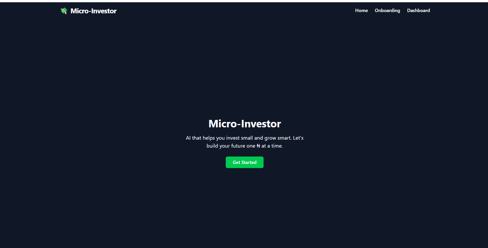

# 💸 MicroInvestor

**AI-powered micro-investment planner built with React, Tailwind, and pure vibes.**  
Helps everyday Nigerians (and beyond) create a personalized investment plan based on their income, goals, and risk tolerance—with charts, summaries, and PDF exports.

---

## 🚀 Features

- 📊 **AI-Powered Investment Advice** – Get smart suggestions using OpenAI or Hugging Face.
- 📈 **Interactive Dashboard** – Visual breakdowns of your allocations (index funds, crypto, emergency fund).
- 🧾 **Export to PDF** – Save your investment plan for later (or bragging rights).
- ⚙️ **Local Data Persistence** – Saves your data in `localStorage` like a real MVP.
- 🎨 **Dark Mode Vibes** – Tailored for night owls and clean UI lovers.

---

## 🛠️ Tech Stack

- ⚛️ React + Vite
- 💨 Tailwind CSS
- 🎞️ Framer Motion
- 🧠 OpenAI / Hugging Face API
- 📄 pdfMake
- 🖼️ html2canvas (for chart export)
